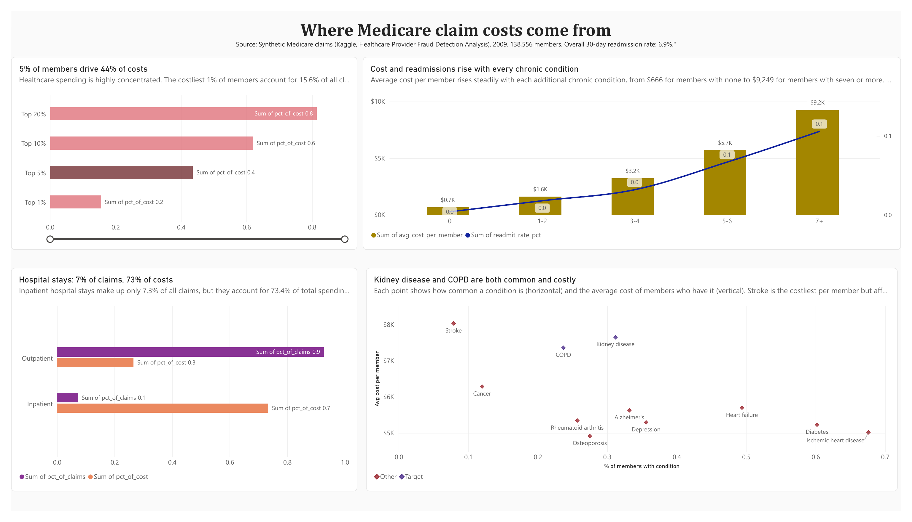

# Where Do Medicare Claim Costs Come From?
### A health plan cost analysis case study (Google Data Analytics Capstone)



## Overview
This case study analyzes **138,556 Medicare members and 558,211 claims** to find which members and types of care drive the largest share of cost. The business questions are modeled on the work of a regional health plan such as UPHP (Upper Peninsula Health Plan).

> This is a self-directed portfolio project using a public, synthetic dataset from Kaggle. It is not affiliated with UPHP and uses none of their data.

**Business task:** Identify which members and types of care drive the largest share of Medicare claim costs, and recommend one targeted action a health plan could take to reduce avoidable costs without limiting members' access to care.

## Key findings
| # | Finding |
|---|---|
| 1 | **5% of members account for 43.6% of total cost**; the bottom half accounts for about 3% |
| 2 | **Hospital stays are 7.3% of claims but 73.4% of cost** |
| 3 | **Members with 5+ chronic conditions are 37% of members but ~65% of cost** |
| 4 | **Readmission rates rise from 0.4% to 10.6%** as chronic conditions increase |
| 5 | **Kidney disease and COPD** are both common and costly |
| 6 | **Age and gender matter little** compared with chronic conditions |

## Tools
BigQuery (SQL) · Power BI · Tableau Public _(in progress)_ · Excel

## The six phases
| Phase | Notes | Highlights |
|---|---|---|
| 1. Ask | [ask.md](01-ask/ask.md) | Business task, stakeholders, 5 SMART questions |
| 2. Prepare | [prepare.md](02-prepare/prepare.md) | First dataset rejected after profiling; ROCCC review |
| 3. Process | [process.md](03-process/process.md) · [cleaning log](03-process/cleaning-log.md) | Cleaned in BigQuery; totals reconciled to $556,543,140 |
| 4. Analyze | [analyze.md](04-analyze/analyze.md) | Q1–Q5 answered with SQL |
| 5. Share | [share.md](05-share/share.md) | Power BI dashboard, chart descriptions |
| 6. Act | [act.md](06-act/act.md) | _In progress_ |

## Repository structure
```
medicare-claims-cost-analysis/
├── README.md
├── 01-ask/ask.md
├── 02-prepare/prepare.md
├── 03-process/process.md, cleaning-log.md
├── 04-analyze/analyze.md
├── 05-share/share.md
├── 06-act/act.md
├── sql/                  ← all BigQuery queries, in run order
├── data/chart_data/      ← small CSVs used for the dashboard
├── dashboard/            ← Power BI file, PDF export, dashboard image
└── screenshots/          ← query results as proof of each step
```

## Data
**Healthcare Provider Fraud Detection Analysis** (Kaggle, Rohit Anand Gupta): synthetic Medicare-style beneficiary, inpatient and outpatient claims, Nov 2008 – Dec 2009. Raw files are not included; see [data/README.md](data/README.md).

## How to reproduce
1. Download the three Train files from Kaggle.
2. Upload them to BigQuery as `Beneficiary`, `Inpatient` and `Outpatient`.
3. Run the files in [`sql/`](sql/) in order (01 → 04), replacing `uphcshoodmaps.Healthcare` with your project and dataset.
4. Load `data/chart_data/*.csv` into Power BI or Tableau.

## Limitations
- Synthetic data from 2009: findings demonstrate the analysis method, not current real-world facts.
- No plan type, pharmacy (Part D) data or provider specialty.
- Readmission rates are lower than real Medicare rates of that period.

## Author
**Vyshnavi Priya Kasarla** · [GitHub](https://github.com/VKasarla05) · _LinkedIn: add link_
