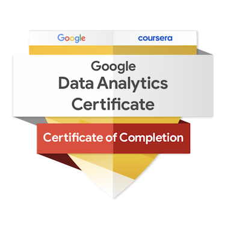

# Certificates

## Google Data Analytics Professional Certificate
Completed **Sep 27, 2026** · [PDF](google-data-analytics-certificate.pdf) · [Verify on Coursera](https://coursera.org/verify/professional-cert/8A94ZKU03MEZ)

## Courses
| # | Course | Completed | File | Verify |
|---|---|---|---|---|
| 1 | Foundations: Data, Data, Everywhere | Jul 30, 2026 | [PDF](course-01-foundations-of-data.pdf) | [Coursera](https://coursera.org/verify/Q027RZ7FVM07) |
| 2 | Ask Questions to Make Data-Driven Decisions | Aug 8, 2026 | [PDF](course-02-ask-questions.pdf) | [Coursera](https://coursera.org/verify/5NHHZWSRMCGU) |
| 3 | Prepare Data for Exploration | Aug 16, 2026 | [PDF](course-03-prepare-data.pdf) | [Coursera](https://coursera.org/verify/3ITANB7FSNW5) |
| 4 | Process Data from Dirty to Clean | Aug 26, 2026 | [PDF](course-04-process-data.pdf) | [Coursera](https://coursera.org/verify/R89POLY0K1B4) |
| 5 | Analyze Data to Answer Questions | Sep 8, 2026 | [PDF](course-05-analyze-data.pdf) | [Coursera](https://coursera.org/verify/CHCXYYEOMVHD) |
| 6 | Share Data Through the Art of Visualization | Sep 21, 2026 | [PDF](course-06-share-data.pdf) | [Coursera](https://coursera.org/verify/0P64VV6YY0N8) |
| 7 | Introduction to Data Analysis Using Python | Sep 25, 2026 | [PDF](course-07-python-data-analysis.pdf) | [Coursera](https://coursera.org/verify/92HIHRW1V9JW) |
| 8 | Google Data Analytics Capstone: Complete a Case Study | Sep 27, 2026 | [PDF](course-08-capstone.pdf) | [Coursera](https://coursera.org/verify/8BZGNL28J6Z9) |
| 9 | Accelerate Your Job Search with AI | Sep 27, 2026 | [PDF](course-09-job-search-with-ai.pdf) | [Coursera](https://coursera.org/verify/V3TL8ENFJHN3) |
